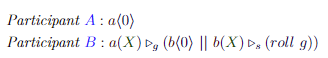
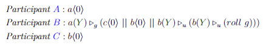
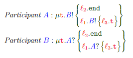
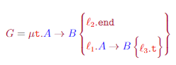

# Reversibility in Multiparty Session Types

This project is the implementation in Rust of the encoding presented in the MSc project "Reversibility & fault-tolerance in Multiparty Session Types".

It allows for running roll-pi calculus terms where processes can run on different threads. 

## Usage
- Build project with: `cargo build`
- Run project with `cargo run`
- Logs can be checked under the `logs` folder to confirm that the correct communications and state evolution is taking place between the participants.

## Scenarios
- In the main file, you can pick which scenario to run from the scenarios folder. The scenarios highlight the use of reversibility and the encoding of local types into roll-pi terms which are later evaluated.
- The 3 scenarios included are:
    
    1. 
        
    2. 
        
    3. 
        

        And the corresponding global type `G`:
        
        

## How it works
- To create an environment, provide a list of pairs of participant names and Processes. The process can be either from manually using the syntax of the calculus (`Process` enum) or from a local type (`PartLocalType`) 
- Use the environment object to execute the participants and their corresponding processes on different threads.

## Roadmap

- [x] Basic data structures for local types
- [x] Basic data structures for roll-pi calculus
- [x] Environment to run roll-pi calculus terms with reversibility
- [ ] Environment to run roll-pi calculus with crash handling
